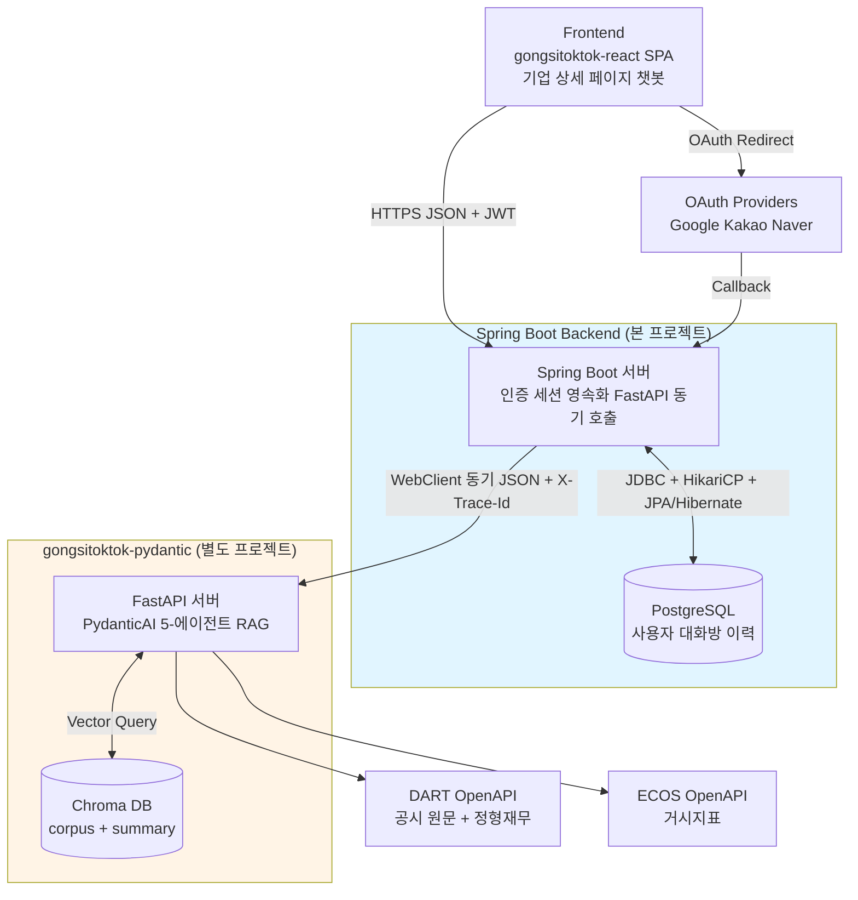

# 공시톡톡 Backend (Spring)

> **공시톡톡 백엔드** — 사용자가 기업 상세 페이지에서 챗봇으로 공시·재무·거시 질의응답.
> 인증·세션·이력 영속화와 AI 추론 서버(FastAPI) 동기 호출을 담당하는 **컨트롤 타워**.

`Spring Boot 3.5.4` · `Java 21 (Virtual Threads)` · `PostgreSQL 16` · `WebClient ↔ gongsitoktok-pydantic` · `JWT + OAuth2`

---

## 🏗 시스템 아키텍처 (3-tier)

세 시스템이 명확한 책임 경계를 가지며, 각자 자기 DB만 소유한다. Spring 이 **컨트롤 타워**,
AI 추론은 별도 프로젝트(`gongsitoktok-pydantic`, PydanticAI 기반)가 담당한다.



| 계층 | 구성 | 역할 |
|---|---|---|
| Frontend | `gongsitoktok-react` (React SPA) | 사용자 진입점, 챗봇 UI |
| **Spring Boot** | Spring Boot + PostgreSQL | **인증·세션·FastAPI 호출·영속화** (본 프로젝트) |
| AI 추론 | `gongsitoktok-pydantic` (FastAPI + PydanticAI + Chroma) | RAG 검색, 답변 생성, 검증 (stateless) |
| 외부 API | OAuth · DART · ECOS | 인증 위탁 · 공시/재무 · 거시 지표 |

> **AI 파트 메모** — v2.0에서 CrewAI → **PydanticAI**로 재구축. Spring 입장에선 단일 endpoint
> `POST /api/v1/chat`(동기 JSON)만 호출하므로 프레임워크 변경의 영향을 받지 않는다.

---

## 🛠 기술 스택

| 영역 | 채택 |
|---|---|
| 언어 / 런타임 | Java 21 (Virtual Threads 활성, `-Djdk.tracePinnedThreads=short`) |
| 프레임워크 | Spring Boot 3.5.4 |
| 빌드 | Gradle 8.x (Groovy DSL) |
| DB | PostgreSQL 16 (로컬 Docker) |
| 외부 호출 | WebClient (spring-webflux, 90s response timeout) |
| 캐시 | Caffeine 3.1.8 (JWT 검증·블랙리스트, 동적 TTL) |
| 보안 | Spring Security + OAuth2 Client (Google·Kakao·Naver) + JJWT 0.12.6 |
| 문서 | Springdoc OpenAPI 2.6.0 (Swagger UI) |
| 관측성 | MDC traceId 전파 (context-propagation 1.1.1) + `X-Trace-Id` |
| 동시성 | 가상 스레드 + BCrypt 전용 플랫폼 풀 격리 + `ReentrantLock` |
| 환경 | spring-dotenv 4.0.0 (`.env` 자동 로드) |

---

## 🚀 빠른 시작

```bash
# 1. PostgreSQL (Docker, 한 번만)
docker run -d --name gongsi-pg -p 5432:5432 \
  -e POSTGRES_USER=gongsi -e POSTGRES_PASSWORD=gongsi \
  -e POSTGRES_DB=gongsitoktok \
  -v gongsi-pg-data:/var/lib/postgresql/data postgres:16

# 2. Spring 백엔드 (port 8080)
./gradlew bootRun --args='--spring.profiles.active=dev'

# 3. Swagger UI
#    http://localhost:8080/swagger-ui/index.html
```

> AI 추론 서버(`gongsitoktok-pydantic`, port 8000)는 **별도 레포**에서 기동한다. Spring 은
> `FASTAPI_BASE_URL`(기본 `http://localhost:8000`)로 동기 호출한다. AI 서버 미기동 시 챗봇만 동작 불가.

---

## 📋 주요 기능 / API 일람

총 **20개 endpoint** (모두 `/api/v1` prefix) + OAuth2 자동 콜백.

### Auth (`/api/v1/auth`) — 4
| 메서드 | 경로 | 설명 |
|---|---|---|
| POST | `/auth/signup` | 회원가입 (로컬) |
| POST | `/auth/login` | 로그인 (로컬) |
| POST | `/auth/refresh` | Access Token 갱신 (Refresh rotation) |
| POST | `/auth/logout` | 로그아웃 |

### User (`/api/v1/users`) — 3
| 메서드 | 경로 | 설명 |
|---|---|---|
| GET | `/users/me` | 마이페이지 조회 |
| PATCH | `/users/me/password` | 비밀번호 변경 (LOCAL 전용) |
| POST | `/users/me/withdraw` | 회원 탈퇴 (Soft Delete) |

### Company (`/api/v1/companies`) — 4
| 메서드 | 경로 | 설명 |
|---|---|---|
| GET | `/companies/count` | 활성 기업 개수 |
| GET | `/companies/main` | 메인페이지 노출 기업 목록 |
| GET | `/companies/{corpCode}` | 특정 기업 상세 |
| GET | `/companies` | 기업 목록/검색 (`?corpCode=&corpName=`) |

### Chat (`/api/v1/chat`) — 6
| 메서드 | 경로 | 설명 |
|---|---|---|
| POST | `/chat/ask` | 최초 질문 + 대화방 생성 |
| POST | `/chat/room/{roomId}/continue` | 이어하기 (Multi-turn) |
| GET | `/chat/rooms` | 마이페이지 — 만료 대화방 목록 (조회 시 lazy close) |
| GET | `/chat/room/{roomId}/messages` | 대화방 타임라인 조회 |
| GET | `/chat/room/active` | 기업별 내 활성 방 lookup (`?corpCode=...`) |
| POST | `/chat/room/{roomId}/close` | 대화방 명시적 종료 (멱등) |

> **v2 변경** — `POST /chat/room/{roomId}/hide` 는 **제거**됐다(`isActive` 의미가 "세션 활성 여부"로
> 재정의되며 hide 개념 소멸). 대신 `/close`(명시적 종료) + `/room/active`(활성 방 lookup, SOFT 단일 정책)가 추가됐다.

### Internal (`/api/v1/internal`) — 3 · 운영자 전용
| 메서드 | 경로 | 설명 |
|---|---|---|
| PATCH | `/internal/companies/{corpCode}` | 기업 정보 upsert |
| POST | `/internal/companies/main` | 메인페이지 노출 핀 등록/갱신 |
| POST | `/internal/companies/main/{corpCode}/remove` | 메인페이지 노출 핀 해제 |

> ⚠️ `/internal/**` 는 v6 시점 인증 없음(임시 permitAll). **운영 배포 전 IP 화이트리스트 + API Key 차단 필수.**

---

## 🔑 도메인 핵심 정책

- **식별자 이중화** — 외부 노출(`userId`/`corpCode`) vs 내부 FK(`userSeq`/`companySeq`). JWT `sub = String.valueOf(userSeq)`.
- **Soft Delete** — 탈퇴·대화방 종료 모두 `isActive=false` (hard delete 금지). 탈퇴 시 `userId` 뒤에 `#dismiss_{epochMillis}` suffix → UNIQUE 충돌 회피 + FK 보존.
- **30분 만료 (3 트리거)** — ① `/continue` 진입 시 만료면 `410 CHAT_ROOM_EXPIRED` ② `/rooms` 조회 시 lazy close ③ **`ChatRoomExpiryScheduler` 1분 주기 `@Scheduled` 일괄 close** (패널 열어둔 채 이탈한 세션도 자동 정리).
- **한 대화방 = 한 기업** — `tb_chat_room.company_seq` 박힘, 변경 불가.
- **SOFT 단일 활성 방** — 동일 `(userSeq, corpCode)` 활성 방을 DB unique 없이 lookup 시 `lastActiveAt DESC LIMIT 1` 채택 + 나머지 lazy close. race로 잠시 다수 공존해도 사용자엔 항상 1개만 노출.
- **JWT + Refresh Rotation** — Access 1h(메모리) + Refresh 14d(SHA-256 해시 DB 저장 + httpOnly 쿠키) + **재사용 탐지**(revoke된 토큰 재사용 시 전체 revoke).
- **가상 스레드 + Pin 방어** — LLM 90초 대기를 `.block()`으로 처리하되 carrier 무점유. BCrypt는 전용 플랫폼 풀 격리, 동시성 제어는 `synchronized` 대신 `ReentrantLock`.

> **🔒 백엔드 구현 완료 · 프론트 UI 미노출** — 아래 기능은 백엔드 로직·endpoint가 완성돼 있으나,
> 현재 프론트엔드에 진입점이 노출돼 있지 않다(MVP 단계 결정).
> - **OAuth2 로그인** (Google·Kakao·Naver) — 콜백 핸들러·언링크 클라이언트까지 구현, client-id는 placeholder
> - **비밀번호 변경** (`PATCH /users/me/password`)
> - **회원 탈퇴** (`POST /users/me/withdraw`, dismiss 정책)

---

## 📁 프로젝트 구조

```
src/main/java/com/gongsitoktok/assistant/
├── auth/        # 회원가입·로그인·JWT·OAuth
│   ├── controller · dto · entity · repository · service
│   ├── jwt/        # 토큰 발급·검증·블랙리스트
│   ├── oauth/      # OAuth2 콜백·언링크 클라이언트
│   └── validator/  # userId·비밀번호 정책 검증
├── user/        # 마이페이지·비밀번호 변경·탈퇴
├── company/     # 기업 조회 (공개)
├── chat/        # 챗봇
│   ├── controller · dto · dto/fastapi · entity · repository
│   ├── client/     # FastApiChatClient · UpstreamErrorMapper
│   ├── scheduler/  # ChatRoomExpiryScheduler (1분 주기 만료 close)
│   └── service/    # ChatRoomService · ChatPersistenceService · ChatHistoryService
├── internal/    # 운영자 전용 (기업 upsert · 메인 핀)
└── global/      # config · error(+exception) · filter · security
```

- 패키지 구조: **Package by Feature + 3-tier Layered**
- 도메인별 수직 분할 + 각 도메인 안에서 `controller → service → repository → entity` 계층
- DDD 의 Rich Domain Model 만 가볍게 차용

---

## ⚙️ 환경변수 (`.env`)

`spring-dotenv` 가 부팅 시 자동 로드. 주요 키:

| 키 | 용도 | 기본값 |
|---|---|---|
| `FASTAPI_BASE_URL` | AI 추론 서버(gongsitoktok-pydantic) 주소 | `http://localhost:8000` |
| `DB_URL` · `DB_USER` · `DB_PASSWORD` | PostgreSQL (prod) | dev는 `application-dev.yml` 고정값 |
| `JWT_SECRET` | JWT 서명 키 | — |
| `CORS_ALLOWED_ORIGINS` | 화이트리스트 (콤마 구분) | `http://localhost:5173` 등 |
| `REFRESH_COOKIE_SECURE` | Refresh 쿠키 Secure 플래그 | prod=true / dev=false |
| `OAUTH_*` | Google·Kakao·Naver client-id/secret | 미설정 시 `disabled-*` placeholder |

> CORS 는 `allowCredentials=true`(Refresh 쿠키 cross-origin) + Origin 화이트리스트만. 와일드카드 금지.

---

## 🔧 빌드 · 실행 · 프로파일

```bash
./gradlew bootRun --args='--spring.profiles.active=dev'   # 개발 실행
./gradlew test                                             # 테스트
./gradlew build                                            # 빌드
```

| 프로파일 | ddl-auto | show-sql | 비고 |
|---|---|---|---|
| `dev` | `update` | `true` | DB 자격 고정값(`gongsi/gongsi`), 쿠키 Secure off, DEBUG 로깅 |
| `prod` | `validate` | `false` | DB·시크릿 전부 환경변수 주입, INFO 로깅 |

JVM 옵션 `-Djdk.tracePinnedThreads=short` 는 `bootRun` 에 자동 부착(가상 스레드 pin 진단).

---

## 📡 API 문서 (Swagger)

부팅 후 `http://localhost:8080/swagger-ui/index.html`

| 그룹 | 노출 범위 |
|---|---|
| **public** (default) | Auth · User · Company · Chat — 프론트 호출용 |
| **internal** | 운영자 전용 upsert·메인 핀 — 노출 의도 분리 |

---

## 📊 종합 시스템 보고서

3-tier 전체 시스템(React · Spring · PydanticAI)을 처음 보는 사람도 파악할 수 있게 정리한 종합 보고서를
GitHub Pages 로 호스팅한다. 아키텍처·데이터 모델·API·시퀀스 흐름·AI 파이프라인·트러블슈팅·시연 시나리오 포함.

- **v2.0 (현재 · PydanticAI 재구축)** — https://jaymunsh.github.io/sesac-gongsitoktok-spring/report_mvp2.0.html
- v1.0 (동결 · CrewAI 시점) — https://jaymunsh.github.io/sesac-gongsitoktok-spring/report_mvp1.0.html

> AI 파트(`gongsitoktok-pydantic`) 단독 설명서는 별도 레포에서 호스팅된다.
