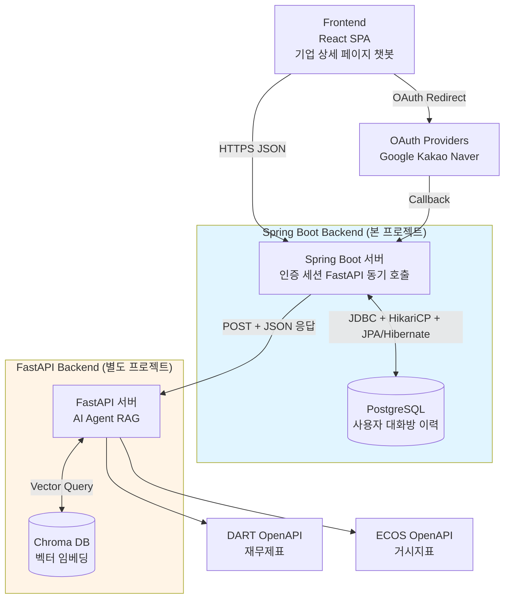

# 공시톡톡 Backend (Spring)

> **공시톡톡 백엔드** — 사용자가 기업 상세 페이지에서 챗봇으로 공시·재무·거시 질의응답.

`Spring Boot 3.5` · `Java 21 (Virtual Threads)` · `PostgreSQL` · `WebClient ↔ FastAPI` · `JWT + OAuth2`

---

## 🏗 시스템 아키텍처 (인프라 관점)

3-tier 수직 흐름. Spring 이 **컨트롤 타워**, FastAPI 가 **AI 추론 엔진**, 두 시스템이 각자 DB 를 소유한다.



| 계층 | 구성 | 역할 |
|---|---|---|
| Frontend | React SPA | 사용자 진입점, 챗봇 UI |
| **Spring Boot** | Spring Boot + PostgreSQL | 인증·세션·FastAPI 호출·영속화 |
| FastAPI | FastAPI + Chroma | AI 추론, 벡터 검색, 외부 API |
| 외부 API | OAuth · DART · ECOS | 인증 위탁 · 재무 · 거시 지표 |


---

## 🛠 기술 스택

| 영역 | 채택 |
|---|---|
| 언어 / 런타임 | Java 21 (Virtual Threads 활성) |
| 프레임워크 | Spring Boot 3.5.x |
| 빌드 | Gradle (Groovy DSL) |
| DB | PostgreSQL 16 (로컬 Docker) |
| 외부 호출 | WebClient (Netty, 90s response timeout) |
| 캐시 | Caffeine (JWT 검증·블랙리스트) |
| 보안 | Spring Security + OAuth2 Client (Google·Kakao·Naver) + JJWT 0.12 |
| 문서 | Springdoc OpenAPI v2 (Swagger UI) |
| 동시성 | 가상 스레드 + BCrypt 전용 플랫폼 풀 격리 |

---

## 📋 주요 기능

총 **14개 endpoint** + OAuth2 자동 콜백.

| 카테고리 | endpoint |
|---|---|
| **Auth** | `POST /auth/signup` · `POST /auth/login` · `POST /auth/refresh` · `POST /auth/logout` |
| **User** | `GET /users/me` · `PATCH /users/me/password` · `POST /users/me/withdraw` |
| **Company** | `GET /companies/{corpCode}` · `GET /companies` |
| **Chat** | `POST /chat/ask` · `POST /chat/room/{roomId}/continue` · `GET /chat/rooms` · `GET /chat/room/{roomId}/messages` · `POST /chat/room/{roomId}/hide` |
| **Internal** | `PATCH /internal/companies/{corpCode}` (운영자 전용, v6 임시 permitAll) |

### 도메인 핵심 정책

- **식별자 이중화** — 외부 노출(`userId`/`corpCode`) vs 내부 FK(`userSeq`/`companySeq`)
- **Soft Delete** — 탈퇴·대화방 숨김 모두 `isActive=false` (hard delete 금지)
- **30분 만료** — `/chat/continue` 시 `lastActiveAt` 기준 초과면 `CHAT_ROOM_EXPIRED`
- **JWT + Refresh Rotation** — Access 1h(메모리) + Refresh 14d(SHA-256 해시 + httpOnly 쿠키) + 재사용 탐지
- **한 대화방 = 한 기업** — `tb_chat_room.company_seq` 박힘, 변경 불가


## 📁 프로젝트 구조

```
src/main/java/com/gongsitoktok/assistant/
├── auth/        # 회원가입·로그인·JWT·OAuth (controller/service/jwt/oauth/validator)
├── user/        # 마이페이지·비밀번호 변경·탈퇴
├── company/     # 기업 조회 (공개)
├── chat/        # 챗봇 (controller/service/client/dto+fastapi)
├── internal/    # 운영자 전용 (기업 upsert)
└── global/      # config · filter · security · error (전역 공통)
```

- 패키지 구조: **Package by Feature + 3-tier Layered**
- 도메인별 수직 분할 + 각 도메인 안에서 `controller → service → repository → entity` 계층
- DDD 의 Rich Domain Model 만 가볍게 차용

---

## 📡 API 문서

부팅 후 `http://localhost:8080/swagger-ui/index.html`

| 그룹 | 노출 범위 |
|---|---|
| **public** (default) | Auth · User · Company · Chat — 프론트 호출용 |
| **internal** | 운영자 전용 upsert — 노출 의도 분리 |
